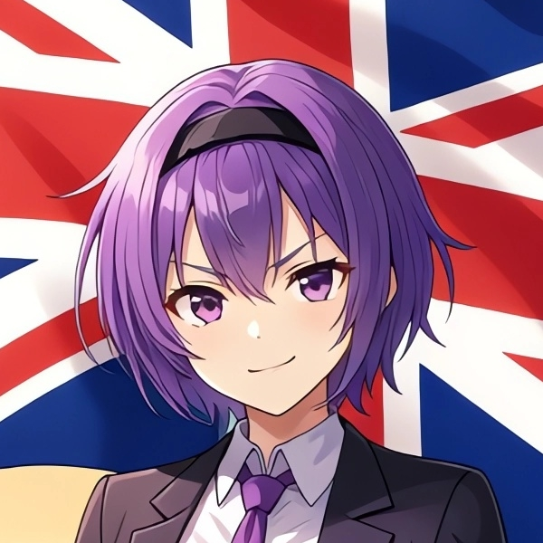
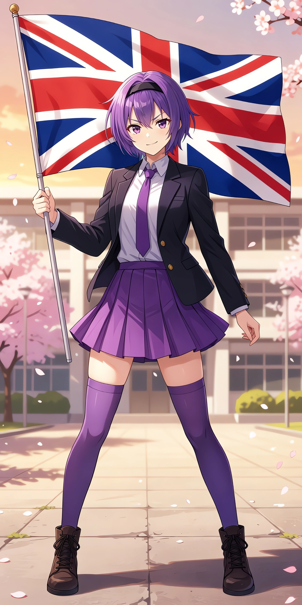
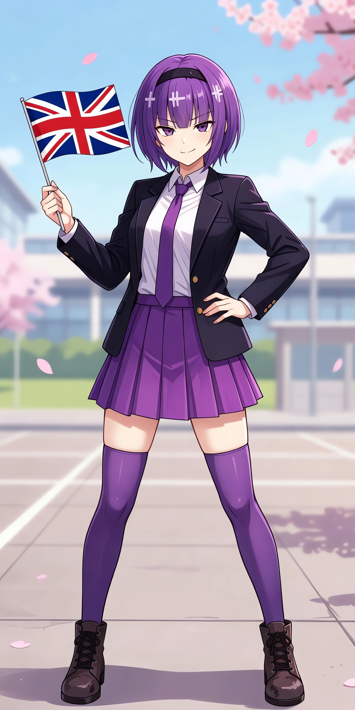
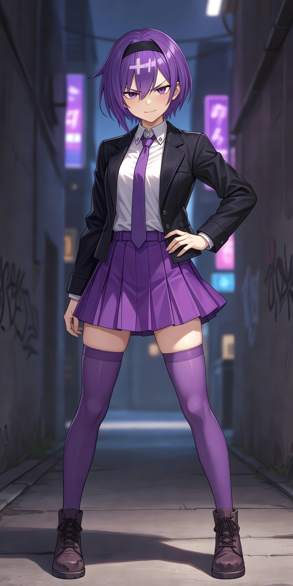
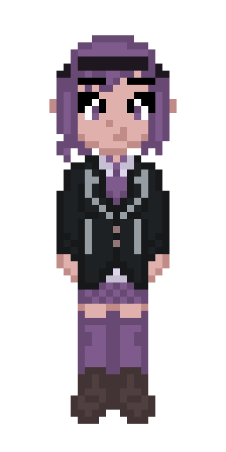

# Emilia Britannia

## Introduction

Emilia Britannia is an original character representing British freedom and inspired by international politics.

A symbol of freedom and anti-censorship, she is licensed under [CC0](https://creativecommons.org/publicdomain/zero/1.0) (public domain). Unlike many other characters and symbols, Emilia is free to use without restriction.

Emilia is an independent young adult woman, with a rebellious personality. She is British and critical of censorship.

## Appearance

Emilia has short, purple hair with bangs and a black headband. She wears a school uniform featuring a black jacket, a white shirt, a purple tie, a purple skirt, purple over-the-knee socks and brown boots. She has purple eyes and light skin. She commonly holds a British flag.

## Anime Style

Emilia innocently waves a large British flag.

## Anime Style (Alternate 1)

Emilia snarkily waves a small British flag.

## Anime Style (Alternate 2)

Emilia in a delinquent style.

## Pixel Art Style

Emilia in a 32x64 pixel art style.
Contains the official colour codes for each part of her appearance.

## Why?

For a long time, the internet has been a place where users can speak freely, openly and anonymously, even in more authoritarian-leaning countries. With a perceived crackdown on internet freedom, a desire for mascots representing freedom has arisen. Many existing mascots are burdened by copyright law and trademarks, which could potentially be used to censor free expression. Since Emilia Britannia is in the public domain, her use should not be censorable by copyright law.

As a character in the public domain, she can be used for:
- Cameo appearances in games, animations, movies, books, or artworks
- Symbolising free speech, freedom, anti-censorship, or anti-propaganda
- Memes, posts, profile pictures, or wallpapers
- Physical merchandise, such as posters, pillows, or figurines
- Any other use in compliance with the [CC0](https://creativecommons.org/publicdomain/zero/1.0) license

## Background

Emilia Britannia is an original character created by Joyless.

Emilia's "Anime Style" images were generated with Grok Imagine using [Dezgo](https://dezgo.com) and upscaled using [Bigjpg](https://bigjpg.com).

Emilia's "Pixel Art Style" images were drawn in the style of the [Universal Character Bases](https://github.com/Joy-less/UniversalCharacterBases).

Emilia's design was inspired by:
- [Ryuuko Matoi](https://myanimelist.net/images/characters/12/233351.jpg), an original character from Kill la Kill by Studio Trigger
- [Enri Louvre](https://static.wikia.nocookie.net/purgatoryrpg/images/5/56/Purgatory_3_Teaser.jpg), an original character from Purgatory by Nama
- [An Amelia with Spirit](https://cults3d.com/en/3d-model/art/an-amelia-with-spirit), an original model made with AI by bradjune

Emilia is licensed under [CC0](https://creativecommons.org/publicdomain/zero/1.0) (public domain), as are all assets in this repository. The creator accepts no liability or responsibility for how you use the character. The character must not be used in a way that suggests the creator endorses your use.